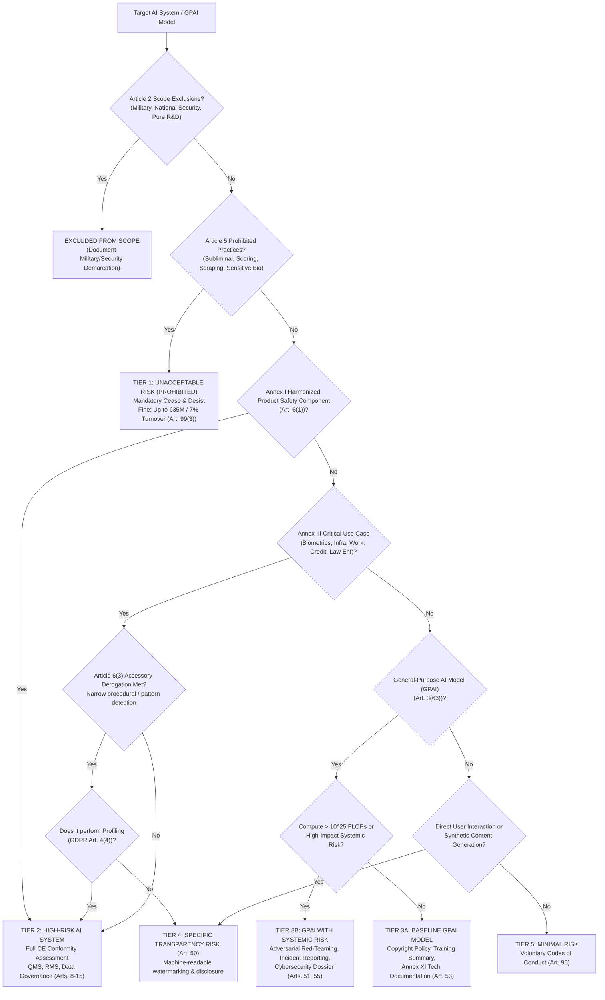

# EU AI Act: Comprehensive Risk Classification Decision Tree

```mermaid
flowchart TD
    A["Target AI System / GPAI Model"] --> B{"Article 2 Scope Exclusions?<br>(Military, National Security, Pure R&D)"}
    B -- Yes --> EXEMPT["EXCLUDED FROM SCOPE<br>(Document Military/Security Demarcation)"]
    B -- No --> C{"Article 5 Prohibited Practices?<br>(Subliminal, Scoring, Scraping, Sensitive Bio)"}
    
    C -- Yes --> PROHIBITED["TIER 1: UNACCEPTABLE RISK (PROHIBITED)<br>Mandatory Cease & Desist<br>Fine: Up to €35M / 7% Turnover (Art. 99(3))"]
    
    C -- No --> D{"Annex I Harmonized Product Safety Component<br>(Art. 6(1))?"}
    D -- Yes --> HIGHRISK["TIER 2: HIGH-RISK AI SYSTEM<br>Full CE Conformity Assessment<br>QMS, RMS, Data Governance (Arts. 8-15)"]
    
    D -- No --> E{"Annex III Critical Use Case<br>(Biometrics, Infra, Work, Credit, Law Enf)?"}
    E -- Yes --> F{"Article 6(3) Accessory Derogation Met?<br>Narrow procedural / pattern detection"}
    F -- Yes --> G{"Does it perform Profiling<br>(GDPR Art. 4(4))?"}
    G -- Yes --> HIGHRISK
    G -- No --> TRANSPARENCY["TIER 4: SPECIFIC TRANSPARENCY RISK (Art. 50)<br>Machine-readable watermarking & disclosure"]
    F -- No --> HIGHRISK
    
    E -- No --> H{"General-Purpose AI Model (GPAI)<br>(Art. 3(63))?"}
    H -- Yes --> I{"Compute > 10^25 FLOPs or<br>High-Impact Systemic Risk?"}
    I -- Yes --> GPAI_SYSTEMIC["TIER 3B: GPAI WITH SYSTEMIC RISK<br>Adversarial Red-Teaming, Incident Reporting,<br>Cybersecurity Dossier (Arts. 51, 55)"]
    I -- No --> GPAI_BASE["TIER 3A: BASELINE GPAI MODEL<br>Copyright Policy, Training Summary,<br>Annex XI Tech Documentation (Art. 53)"]
    
    H -- No --> J{"Direct User Interaction or<br>Synthetic Content Generation?"}
    J -- Yes --> TRANSPARENCY
    J -- No --> MINIMAL["TIER 5: MINIMAL RISK<br>Voluntary Codes of Conduct (Art. 95)"]
```
